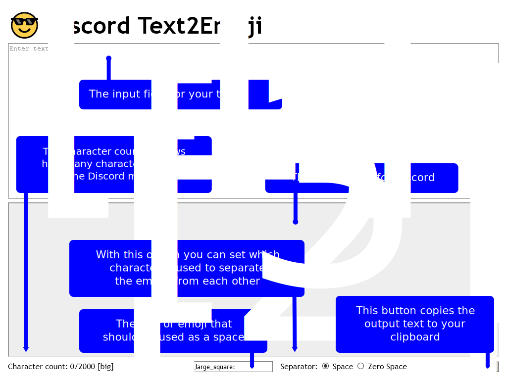
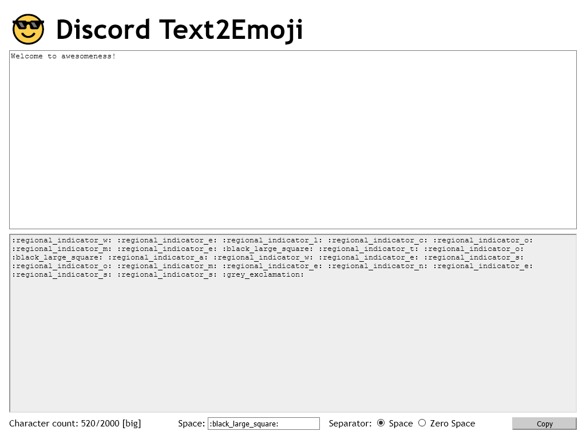
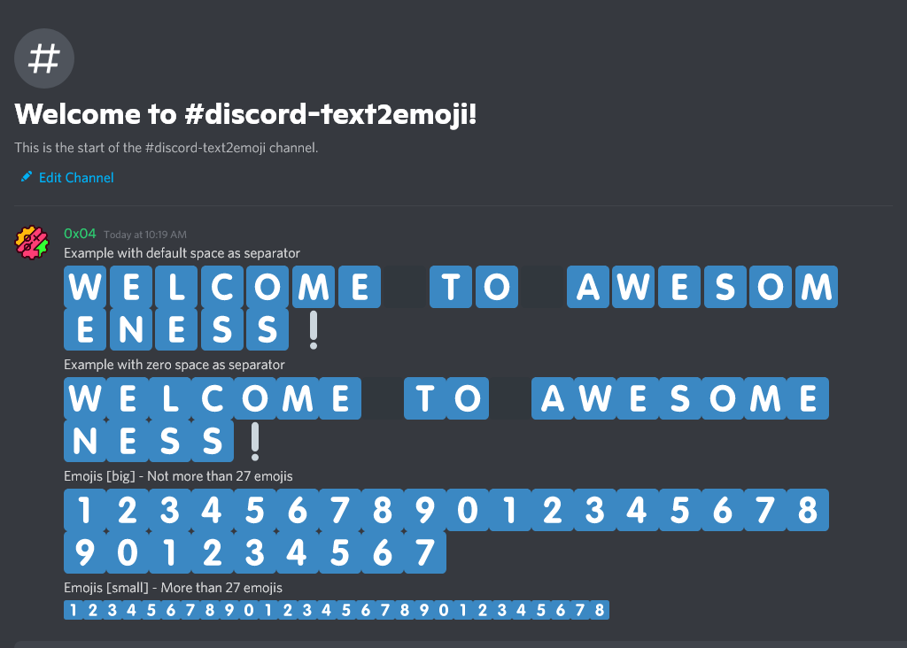

# 😎 Discord Text2Emoji

You want attention? You want to be heard? The font size used in Discord is too small for you? Bold and italics are not enough for you? You want to annoy the participants of a Discord server?

Then we have just the thing for you! This tool converts your text into big, bold emoji letters. Discord provides so called "Regional Indicator" emojis. These are the letters A-Z in emoji format with a light blue background. These are usually used to represent Internet country codes.

## Using the tool is very simple. Here is an overview of the individual functions

### Sidenotes

[1] Discord's character limit is 2000 characters per message. The text in the square brackets indicates whether Discord displays the emojis \[big] or \[small]. Discord displays from 27 emojis in a row in small form.

[2] The space can be normal text or a Discord emoji code e.g. `:black_large_square:`.

[3] The "Regional Indicator" emojis are sometimes combined to a country flag, e.g. if you combine "M" and "E" it becomes the country flag of Mexico. To prevent this behavior, you have to separate the two "Regional Indicator" with a normal character.

## Examples

Have phun!
